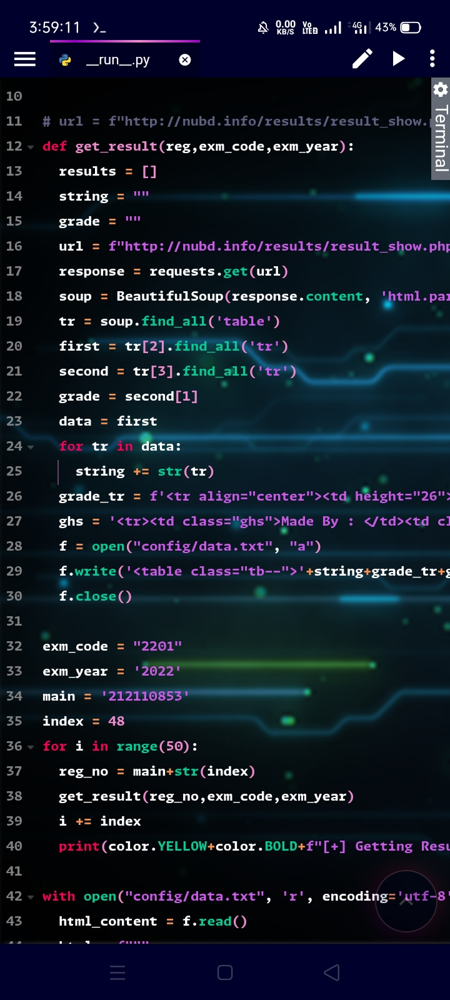
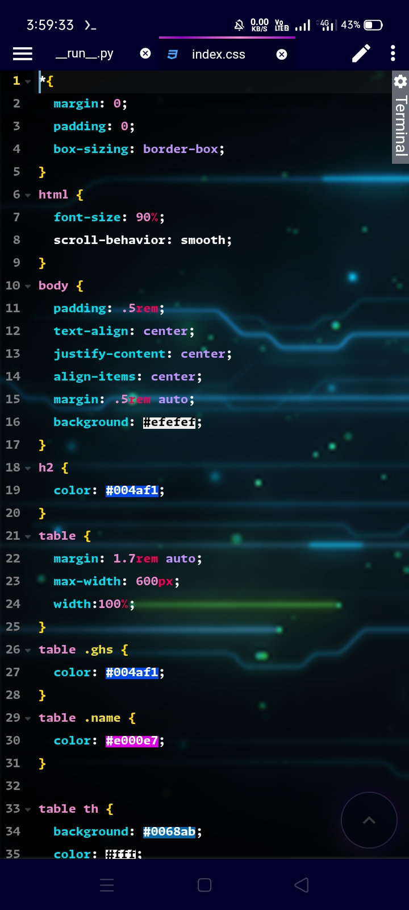
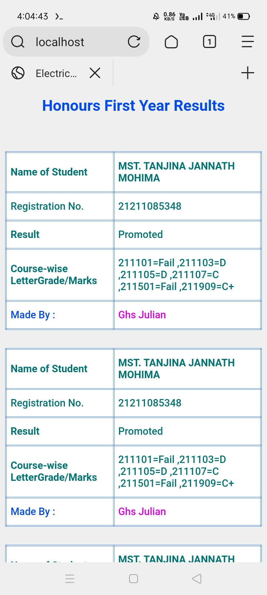
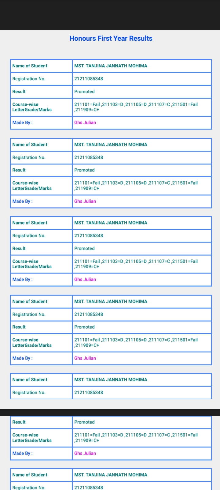

<center>
<h1>Honours First Year Results</h1>
<h2 style="color:red">Developer -<span style="color:rgb(30,255,239)"> Ghs Julian</span></h2>
</center>

---

---

<p>

**Just Clone this repository, if the Bangladesh server is down or server isn't response. then Just clone my repository and use it on your terminal or Termux whatever you want.**

---


```bash
git clone 
cd honours-result
python __run__.py
```

--- 

**After running this command use the command bellows**


```bash
cd config
python2 -m SimpleHTTPServer 8000
```

**Copy 'http://localhost:8000'  the Address and paste in your browser**


--- 


</p>

---

**Screenshots And Demo :**

<center>
<br><br>
<br><br>
<br><br>
<br><br>

</center>


---

---

</p>
<center>
 <h2>Thank You ❤️🙏</h2>
</center>
